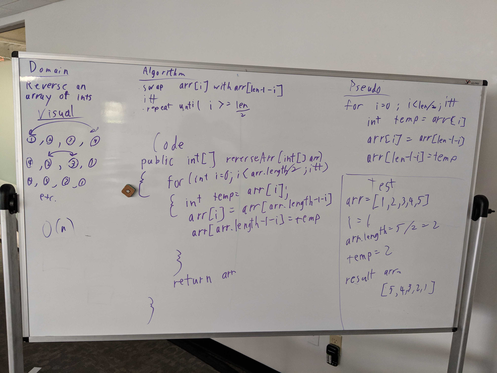
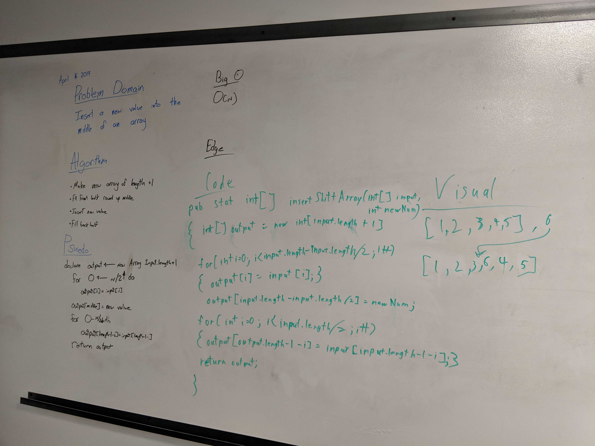
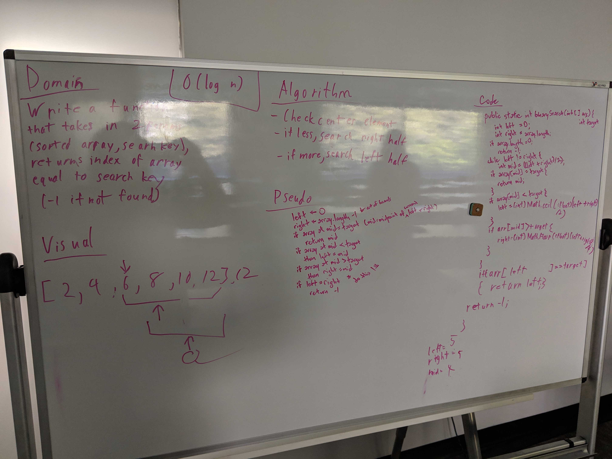
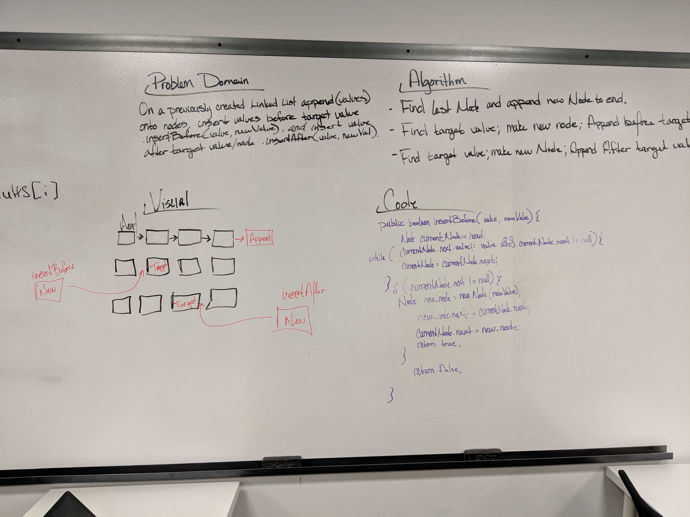
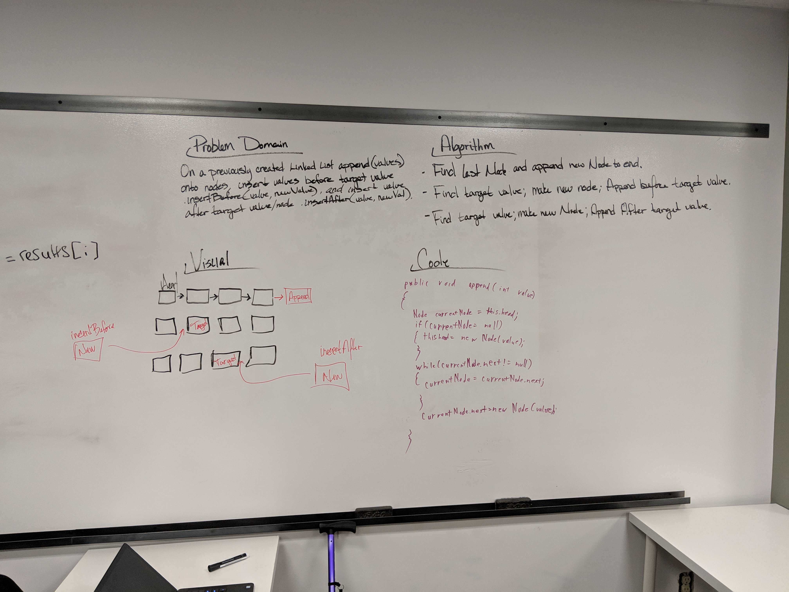
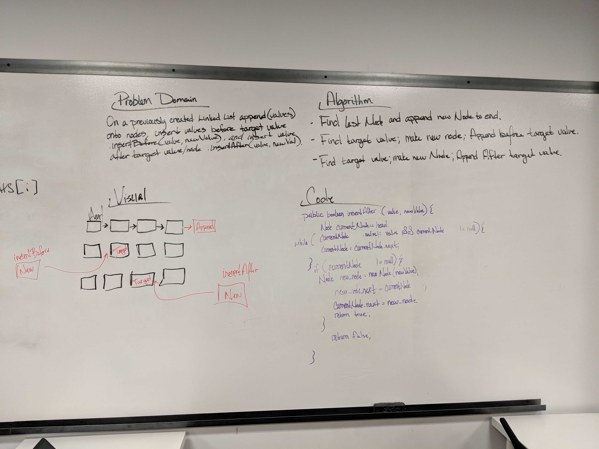
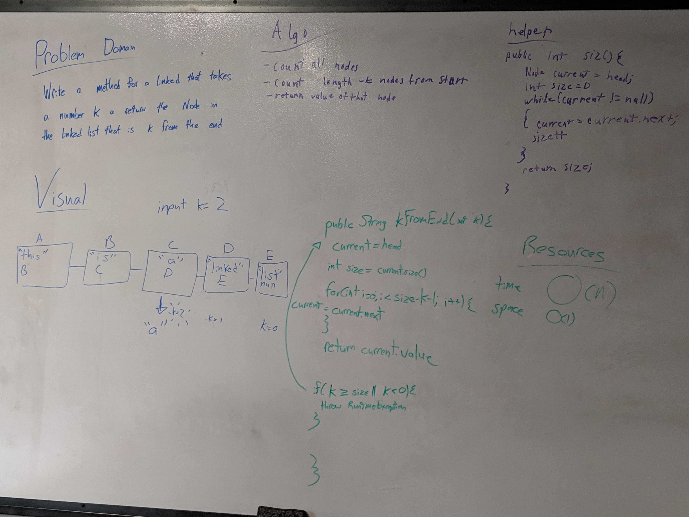

# Data Structures and Algorithms - Java 401d3
<!-- --- -->

## Reverse an Array 

Take an array of integers and reverse it in place.

### Challenge

We are reversing an array. The examples were all integers, so we assumed that was the target. 

### Approach & Efficiency

We used a swap value to reverse the array, starting from the first and last, and moving in. It runs in O(n)

### Whiteboard Solution

### Code ( [Link](./src/main/java/ArrayReverse.java) )

## Insert Shift Array 

### Challenge

Make a function that takes in an array and an integer, and returns an a new array, the same as the input, but with the new value in the middle.

### Approach & Efficiency

We made a new array with a length of the input array's length + 1. We then copied in the first half of the input array (rounding up for odd indexes), put in the new value, and added the last half of the input array (rounding down for odd lengths)

### Whiteboard Solution

### Code ( [Link](./src/main/java/InsertShiftArray.java) )

### Tests ( [Link](./src/test/java/InsertShiftArrayTest.java) )

## Binary Search

### Challenge

Implement a binary search ( [Wikipedia Entry](https://en.wikipedia.org/wiki/Binary_search_algorithm) ) to find the index of an element in an array of integers, returning -1 if not found

### Approach & Efficiency

We defined the left and right of the search area as 0 and the last index of the array. If the midpoint element between those two indexes was the target, we returned the index. If the element at that midpoint was less than the target, we moved the left end of the search range to the midpoint (rounding up for odd widths), if the element was less than the target, we set the rigth side of the search as the midpoint. That repeats until the element is found, or left and right are equal. After that is done, there is one last check to see if the target is at the index contained in both left and right (to ensure that the last possible element is checked), if still not found, -1 is returned.

### Whiteboard Solution

### Code ( [Link](./src/main/java/BinarySearch.java) )

### Tests ( [Link](./src/test/java/BinarySearchTest.java))

## Linked List Implementation 

### Challenge

Create a singly linked list that instantiates empty, can insert new values, can return a boolean result of whether a value is contained, and return a collection of all elements.

### Code ( [Link](./src/main/java/mylinkedlist/MyLinkedList.java) )

### Tests ( [Link](./src/test/java/mylinkedlist/MyLinkedListTest.java))

 - [x] Create and print an empty linked list
 - [x] Create a linked list, insert 2 elements, return collection of those elements
 - [x] Create a linked list, insert 5 elements, return collection of those elements
 - [x] Create a linked list, return true when searching for a value contained in it
 - [x] Create a linked list, return false when searching for a vlue NOT contained in it
 - [x] Create a linked list, add elements, confirm head references last created element

## Link List Insertion Methods

### Code ( [Link](./src/main/java/mylinkedlist/MyLinkedList.java) )

### Tests ( [Link](./src/test/java/mylinkedlist/MyLinkedListTest.java))

### Whiteboard Solutions

#### Append

#### Insert Before

#### Insert After

## Insert Kth From End

### Code ( [Link](./src/main/java/mylinkedlist/MyLinkedList.java))

###Tests ( [Link](./src/test/java/mylinkedlist/MyLinkedListTest.java))

### Whiteboard Solution

