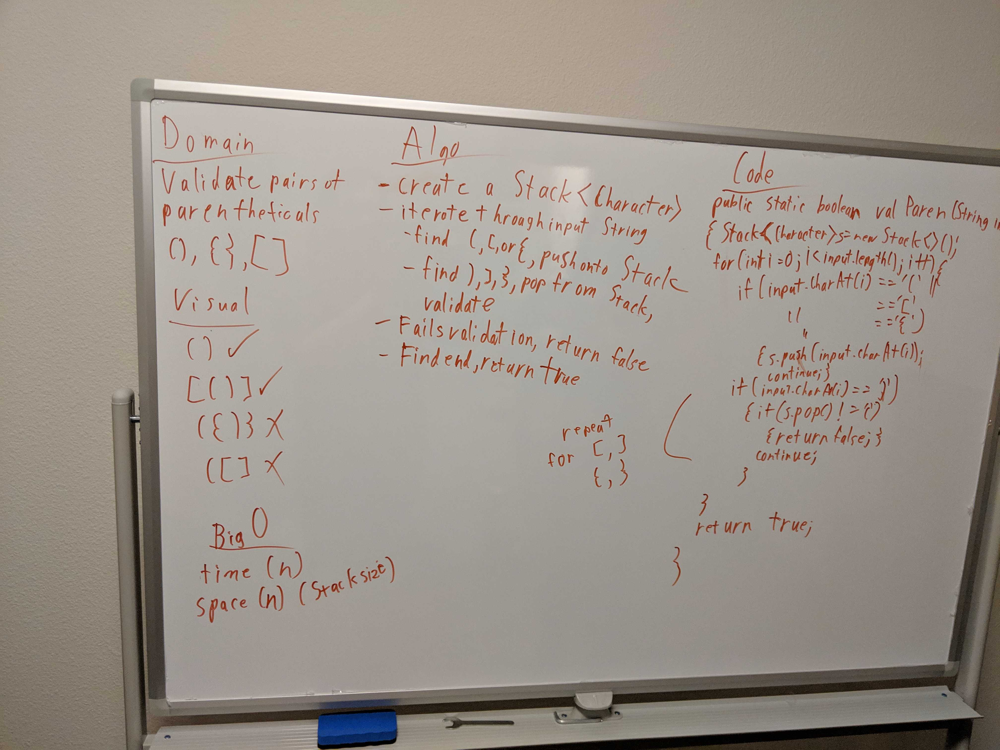

# multibracketvalidation API

## MultiBracketValidation

### Static Methods

#### Stack

| Method | Return | Input | Description |
| --- | --- | --- | --- |
|multiBracketValidation | boolean | String input | Validates that every opening parenthetical (, \[, \{, has a matching close parenthetical ), \], \}, in appropriate scope.

\

## Space and Efficiency

### Stack

| Method | Time | Space | Approach
| --- | --- | --- | ---
|multiBracketInvalidation | O(n) | O(n) | creates a Stack<Character>, then iterates through the string. It ignores anything other than \(,\),\[,\],\{,\}. If it finds an opening character, it pushes it onto the the stack. If it finds a closing character, it pops the top from the stack and compares it to the current character. If they are a matching pair, it continues, if not it returns false. After finishing iterating through the string, it returns true if the stack is empty, false if it has elements.

### Queue

| Method | Time | Space |
| --- | --- | --- |
|Constructor | O(1) | O(1)
|enqueue | O(1) | O(1)
|dequeue | O(1) | O(1)
|peek | O(1) | O(1)

