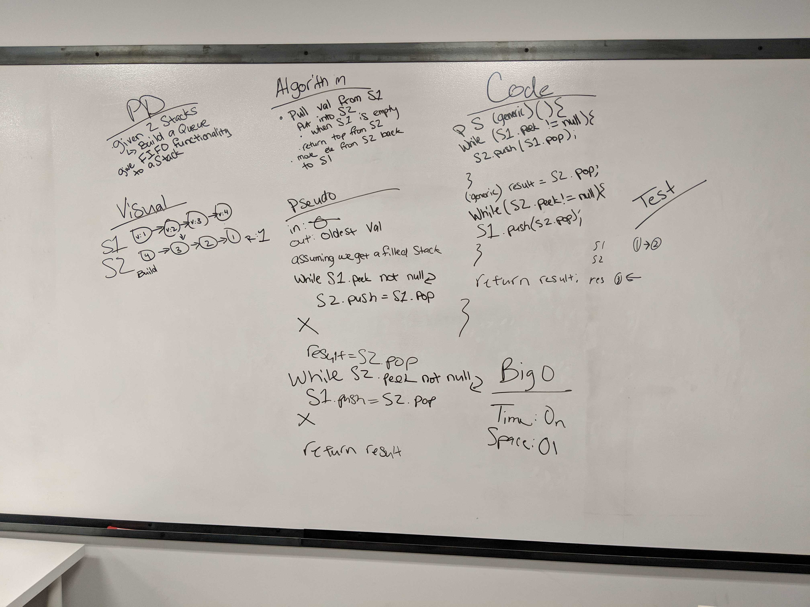

# queuewithstacks API

## PsuedoQueue

### Instance Methods

| Method | Return | Input | Description |
| --- | --- | --- | --- |
| Constructor<T> | new PsuedoQueue | none | Creates a new empty PsuedoQueue that holds values of type T
|enqueue | void | T newValue | Creates a new value containing newValue and puts it at the rear of the Queue
|dequeue | T removedValue | none | Removes the least recently added Node and returns the value it contains
|peek|T peekedValue|none|Returns the least recently added value. Does NOT remove its Node.

## Space and Efficiency

### PsuedoQueue

| Method | Time | Space | Approach
| --- | --- | --- | ---
|constructor|O(1)|O(1) | Creates a Queue with an empty storage Stack and an empty swap Stack.
|enqueue|O(1)|O(1) | Creates a new Node. Pushes the new Node into the storage Stack.
|dequeue|O(1)|O(1) | Pops all values out of the storage Stack, pushing them into the swap Stack. Pops top value off of swap Stack, storing the value for output. Pops the values off of the swap Stack, pushing them back into the storage Stack, then returns the stored value.
|peek|O(1)|O(1) | Pops all values out of the storage Stack, pushing them into the swap Stack. Peeks the value from the top of the swap Stack, storing the value for output. Pops the values off of the swap Stack, pushing them back into the storage Stack, then returns the stored value.

